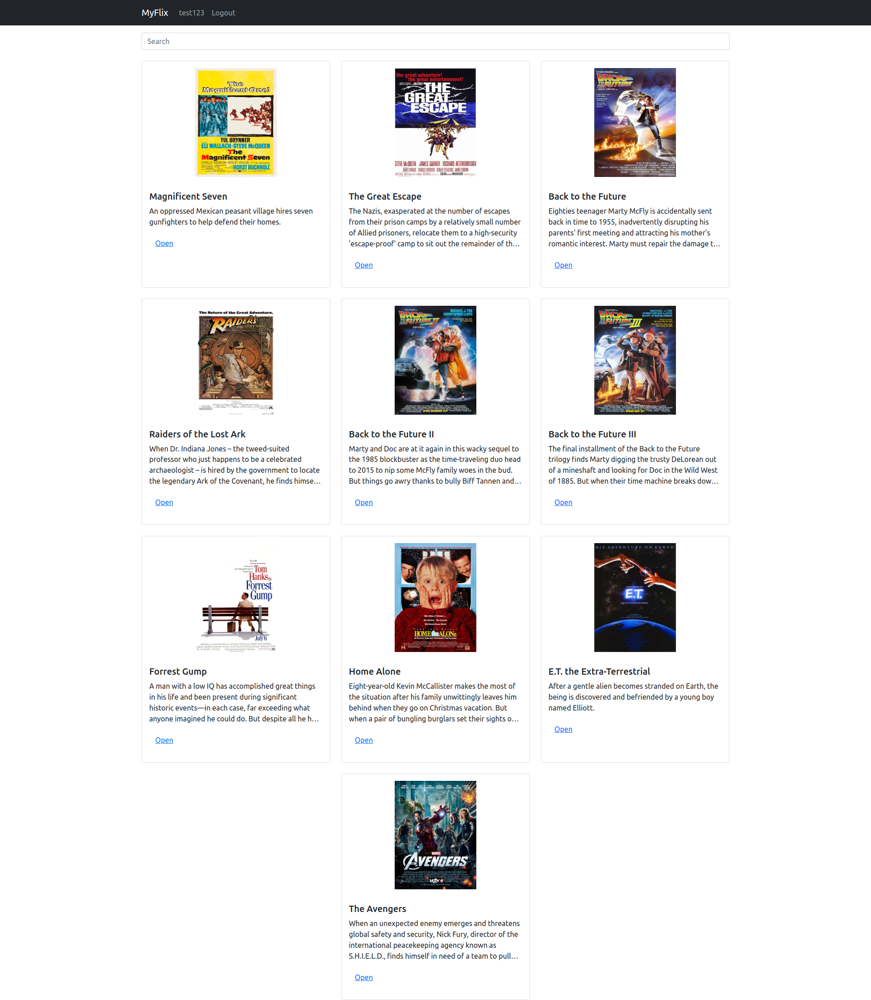
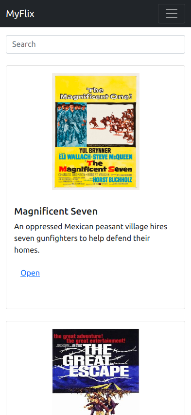

# myFlix-client

This is the client-side of a movie application. The app will allow users to register, display a list of all movies in the database, 
create a list of favourites within which they can add and remove movies, 
get information about different directors and movie genres, they will also be able to deregister from the app.

This app is a SPA built with React.

This app is hosted on Netlify: https://rpmyflix.netlify.app/

The code for the server-side of this app can be found here: https://github.com/carnivalgoblin/movie_api

## Tech Stack

**Client:** React, Redux, SASS, Axios

**Server:** Node, Express, mongoDB

## Installation

Required installation to get started with the App, follow these steps.

Clone the repo
`git clone https://github.com/carnivalgoblin/myFlix-client.git`

Install NPM packages
`npm install`

Start the app
`npm run start`

